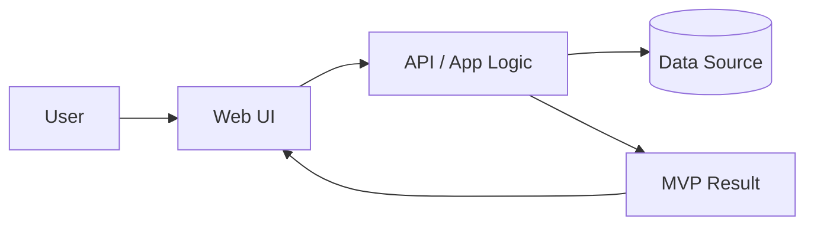

# Architecture Sketch

## High-Level Design

## Frontend
- Technology:
- Key screens:
- Frameworks / libraries:

## Backend
- Technology:
- Key endpoints:
- Authentication:

## Data Layer
- Database or file format:
- What data do we store?
- How do we query it?

## External Integrations
- Third-party APIs or services:
- How do we connect to them?

## Deployment
- Where does this run?
- What is needed for the demo?

## Security & Scaling
- Authentication method:
- Sensitive data concerns:
- Rate limiting, caching, or quotas:

Fill this in once the final MVP direction is known.
