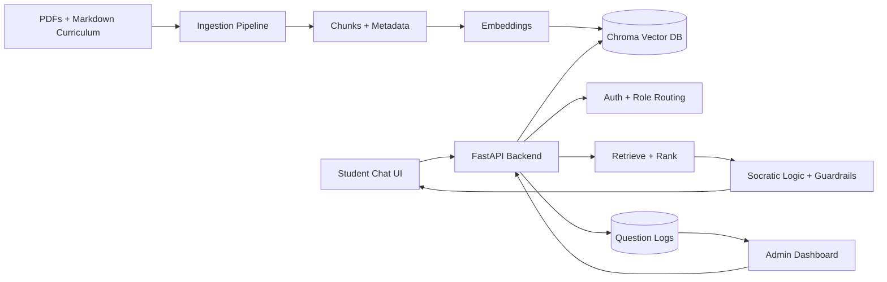

# Architecture Sketch

## High-Level Design

## Frontend
- Technology: React.
- Key screens: student chat, login/role routing, admin log view.
- Responsibilities: send chat requests, display guided responses, write/display logs, route users by role.

## Backend
- Technology: FastAPI.
- Key endpoints:
  - `POST /auth/login`
  - `POST /chat`
  - `GET /admin/logs`
  - `GET /health`
- Responsibilities: auth contract, RAG orchestration, logging, admin data access.

## RAG + Guardrails
- Query gets embedded.
- Chroma returns top-k curriculum chunks.
- Retrieved chunks are ranked before generation.
- System prompt produces Socratic guidance.
- Post-generation validator checks for final-answer leakage and off-curriculum responses.

## Ingestion Pipeline
- Reads PDFs and markdown files.
- Chunks by section or paragraph.
- Embeds chunks with OpenAI embeddings or sentence-transformers.
- Loads chunks and metadata into Chroma.
- Handles malformed files gracefully by logging and skipping.

## Data Layer
- Chroma for vector search over curriculum chunks.
- Log storage for user, question, timestamp, role, retrieved source metadata, and response summary.

## Demo Path
1. Ingest a small set of representative curriculum files.
2. Student asks a stuck-point question.
3. Backend retrieves relevant content and responds Socratically.
4. Admin opens dashboard and sees the logged student question.
